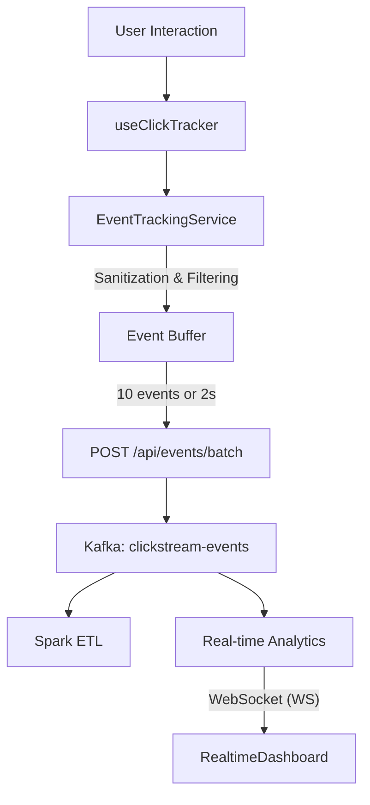

# Frontend Event Tracking Guide

Complete documentation for the event tracking system, session management, and batch event submission.

## Overview

The event tracking system automatically captures user interactions (clicks, page views, scrolls, hovers) and sends them to the backend API for ingestion into Kafka.

### Security Measures

- **XSS Protection:** All `targetElement` paths are sanitized using `DOMPurify` before submission to prevent malicious scripts from being injected into the metrics pipeline.
- **Sensitive Data Filtering:** Automatically filters out tracking for elements marked with sensitive attributes (e.g., `data-sensitive="true"`) or matching sensitive names (e.g., `password`, `creditCard`, `ssn`).

### Key Features

- **Automatic batching:** Events queued and sent in batches (10 events OR 2-second timeout)
- **Session management:** 30-minute timeout with auto-renewal on activity
- **Session persistence:** Across page refreshes and subdomains
- **Event validation:** Schema validation before submission
- **Reliable Submission:** Uses `navigator.sendBeacon` with `fetch` fallback
- **Real-time metrics:** WebSocket connection with automatic exponential backoff and jitter

### Data Flow



---

## Session Management

### Session Lifecycle

```javascript
// 1. CREATION: On first app load
sessionId = UUID v4 (crypto.randomUUID())
sessionTimestamp = now
sessionStorage.setItem('clickstream_session_id', sessionId)
sessionStorage.setItem('clickstream_session_timestamp', timestamp)

// 2. VALIDATION: On every interaction
const SESSION_TIMEOUT = 30 * 60 * 1000  // 30 minutes
const elapsed = now - sessionTimestamp

if (elapsed > SESSION_TIMEOUT) {
  // Session EXPIRED: Create new
  sessionId = UUID v4()
  sessionTimestamp = now
} else {
  // Session VALID: Renew
  sessionTimestamp = now  // Update timestamp
}
```

### Session Timeout Rules

| Event | Behavior | Result |
|-------|----------|--------|
| Click/NavClick within 30min | Timestamp renewed | Same sessionId |
| Page view within 30min | Timestamp renewed | Same sessionId |
| Scroll within 30min | Timestamp renewed | Same sessionId |
| Hover within 30min | Timestamp renewed | Same sessionId |
| **Inactivity > 30min** | Session expires | New sessionId created |
| Page refresh < 30min | sessionStorage persists | Same sessionId |
| Close tab | sessionStorage cleared | Session lost |

---

## Event Tracking in Components

### Tracking Implementation

#### 1. Security-Aware Click Tracking

The `useClickTracker` hook automatically handles sensitive data filtering based on element attributes.

```typescript
// src/components/organisms/ExampleComponent.tsx
import { useClickTracker } from '../hooks/useClickTracker';

export function ExampleComponent() {
  const { trackClick } = useClickTracker('example-component');

  return (
    <div>
      {/* Tracked interaction */}
      <button onClick={(e) => trackClick('submit-btn', {}, e)}>Submit</button>

      {/* SECURE: Sensitive input - automatically ignored by tracking */}
      <input type="password" data-sensitive="true" />
      
      {/* SECURE: Manually ignored */}
      <button data-track="false">Private Action</button>
    </div>
  );
}
```

---

## Real-time Metrics Flow

The dashboard connects to a WebSocket server for real-time updates.

### Connection Reliability

To maintain stability under network fluctuations:
- **Max Retries:** Up to 10 reconnection attempts.
- **Exponential Backoff:** Delay increases with each attempt (3s, 6s, 12s...).
- **Jitter:** Random added delay (up to 1s) to prevent thundering herd on server recovery.

```typescript
// src/contexts/RealtimeContext.tsx
// Logic summary:
const delay = Math.min(reconnectDelayRef.current, 30000) + (Math.random() * 1000);
```

---

## Related Documentation

- [Integration Testing Guide](./integration-testing.md)
- [Configuration Guide](./configuration.md)
- [System Architecture](../system-architecture.md)
```

---

## Event Batching

### Batching Rules

Events are sent to the backend when **ANY** of these conditions are met:

| Condition | Value | Action |
|-----------|-------|--------|
| Queue size reaches | 10 events | Immediately send batch |
| Time elapsed | 2 seconds | Send batch (even if < 10 events) |

### Example: Batching Timeline

```
T+0.0s   User clicks button
  ├─ Event 1 queued
  └─ Queue: [1]

T+0.1s   User clicks another button
  ├─ Event 2 queued
  └─ Queue: [1, 2]

T+0.5s   User scrolls page
  ├─ Event 3 queued
  └─ Queue: [1, 2, 3]

T+1.0s   (still < 2s timeout, < 10 events)
  └─ Queue: [1, 2, 3]

T+2.0s   ⏰ TIMEOUT: 2 seconds elapsed
  ├─ Send POST /api/events/batch { events: [1, 2, 3] }
  └─ Queue: [] (cleared)

T+2.1s   User clicks 8 more buttons rapidly
  ├─ Events 4-11 queued
  └─ Queue: [4, 5, 6, 7, 8, 9, 10, 11]

T+2.15s  ⚡ QUEUE FULL: 10 events accumulated
  ├─ Send POST /api/events/batch { events: [4, 5, 6, 7, 8, 9, 10, 11] }
  └─ Queue: []
```

### Implementation Details

```typescript
// src/contexts/TrackingContext.tsx
const BATCH_SIZE = 10
const BATCH_TIMEOUT = 2000  // 2 seconds

function trackEvent(event: ClickEvent) {
  eventQueue.push(event)
  
  // Check if batch should be sent
  if (eventQueue.length >= BATCH_SIZE) {
    // CONDITION 1: Queue full
    sendBatch()
  } else if (!timeoutId) {
    // CONDITION 2: Start timeout only if not already running
    timeoutId = setTimeout(() => {
      if (eventQueue.length > 0) {
        sendBatch()
      }
      timeoutId = null
    }, BATCH_TIMEOUT)
  }
}

async function sendBatch() {
  if (eventQueue.length === 0) return
  
  const eventsToSend = [...eventQueue]
  eventQueue = []  // Clear queue
  
  try {
    const response = await fetch('/api/events/batch', {
      method: 'POST',
      headers: { 'Content-Type': 'application/json' },
      body: JSON.stringify({ events: eventsToSend }),
    })
    
    if (!response.ok) {
      // Retry logic on failure
      eventQueue.unshift(...eventsToSend)
      retryWithBackoff()
    }
  } catch (error) {
    // Network error: re-queue events
    eventQueue.unshift(...eventsToSend)
  }
}
```

---

## Event Schema

### Full Event Object

```typescript
interface ClickEvent {
  schemaVersion: string        // "1.0"
  eventId: string              // UUID v4
  userId: string               // From TrackingContext
  sessionId: string            // From TrackingContext (30min timeout)
  eventType: EventType         // CLICK | PAGE_VIEW | SCROLL | HOVER
  targetElement: string        // CSS selector or element ID
  pageUrl: string              // window.location.href
  referrerUrl: string          // document.referrer
  timestamp: number            // Date.now() in milliseconds
  userAgent: string            // navigator.userAgent
  metadata: EventMetadata      // Type-specific metadata
}

interface EventMetadata {
  // For CLICK events
  x?: number                   // Cursor X coordinate
  y?: number                   // Cursor Y coordinate
  elementText?: string         // Element's text content
  
  // For SCROLL events
  scrollDepth?: number         // 0.25, 0.5, 0.75, 1.0
  
  // For HOVER events
  durationMs?: number          // Hover duration
  
  // Common
  viewportWidth?: number       // Window width
  viewportHeight?: number      // Window height
}
```

### Event Type Mapping

| Event Type | Trigger | Key Metadata | Example |
|------------|---------|--------------|---------|
| **CLICK** | User clicks interactive element | x, y, targetElement, elementText | `<button>` click |
| **PAGE_VIEW** | Page loads or SPA route changes | pageUrl, referrerUrl | Route navigation |
| **SCROLL** | Scroll depth milestone (25%, 50%, 75%, 100%) | scrollDepth | Reaching page end |
| **HOVER** | Element hovered > 500ms | targetElement, durationMs | Menu hover |

### Validation Rules

```typescript
function validateEvent(event: ClickEvent): string[] {
  const errors: string[] = []
  
  // Required fields
  if (!event.eventId?.match(/^[0-9a-f-]+$/)) errors.push('Invalid eventId')
  if (!event.userId) errors.push('userId required')
  if (!event.sessionId) errors.push('sessionId required')
  if (!['CLICK', 'PAGE_VIEW', 'SCROLL', 'HOVER'].includes(event.eventType)) {
    errors.push('Invalid eventType')
  }
  
  // Timestamp validation
  const now = Date.now()
  if (Math.abs(event.timestamp - now) > 60000) {  // 1 minute tolerance
    errors.push('Timestamp too old or in future')
  }
  
  // Metadata validation
  if (event.eventType === 'CLICK') {
    if (event.metadata?.x === undefined || event.metadata?.y === undefined) {
      errors.push('CLICK requires x, y coordinates')
    }
  }
  
  return errors
}
```

---

## Batch API Request/Response

### Request Format

```http
POST /api/events/batch HTTP/1.1
Host: localhost:9051
Content-Type: application/json

{
  "events": [
    {
      "schemaVersion": "1.0",
      "eventId": "550e8400-e29b-41d4-a716-446655440000",
      "userId": "user-abc-123",
      "sessionId": "sess-xyz-789",
      "eventType": "CLICK",
      "targetElement": "button#checkout",
      "pageUrl": "http://localhost:3000/cart",
      "referrerUrl": "http://localhost:3000/products",
      "timestamp": 1712678400000,
      "userAgent": "Mozilla/5.0 (Windows NT 10.0; Win64; x64)...",
      "metadata": { "x": 450, "y": 320, "elementText": "Checkout" }
    },
    {
      "schemaVersion": "1.0",
      "eventId": "550e8400-e29b-41d4-a716-446655440001",
      ...
    }
    // ... up to 100 events per batch
  ]
}
```

### Response Format

**Success (202 Accepted):**
```json
{
  "message": "Events accepted",
  "acceptedCount": 10,
  "rejectedCount": 0
}
```

**Partial Failure (207 Multi-Status):**
```json
{
  "message": "Some events rejected",
  "acceptedCount": 9,
  "rejectedCount": 1,
  "errors": [
    {
      "eventIndex": 5,
      "reason": "Invalid timestamp"
    }
  ]
}
```

**Failure (4xx or 5xx):**
```json
{
  "error": "Bad request",
  "message": "All events invalid: missing sessionId"
}
```

---

## Retry and Error Handling

### Retry Strategy

```typescript
async function sendBatchWithRetry(events: ClickEvent[], retryCount = 0) {
  const MAX_RETRIES = 3
  const BACKOFF_BASE = 1000  // 1 second
  
  try {
    const response = await fetch('/api/events/batch', {
      method: 'POST',
      headers: { 'Content-Type': 'application/json' },
      body: JSON.stringify({ events }),
    })
    
    if (response.ok || response.status === 202) {
      // Success: clear retry count
      return true
    }
    
    if (response.status >= 500 || response.status === 429) {
      // Server error or rate limit: retry
      throw new Error(`HTTP ${response.status}`)
    }
    
    // Client error (4xx): don't retry
    console.error('Non-retryable error:', response.status)
    return false
    
  } catch (error) {
    if (retryCount < MAX_RETRIES) {
      // Exponential backoff: 1s, 2s, 4s
      const delay = BACKOFF_BASE * Math.pow(2, retryCount)
      console.log(`Retry ${retryCount + 1}/${MAX_RETRIES} after ${delay}ms`)
      
      await new Promise(resolve => setTimeout(resolve, delay))
      return sendBatchWithRetry(events, retryCount + 1)
    }
    
    // Max retries exceeded: persist to localStorage as fallback
    persistToLocalStorage(events)
    return false
  }
}
```

### Fallback to Persistent Storage

If network is permanently unavailable:

```typescript
function persistToLocalStorage(events: ClickEvent[]) {
  const stored = JSON.parse(localStorage.getItem('pending_events') || '[]')
  const updated = [...stored, ...events]
  
  // Keep last 1000 events max
  if (updated.length > 1000) {
    updated.splice(0, updated.length - 1000)
  }
  
  localStorage.setItem('pending_events', JSON.stringify(updated))
  console.log(`Persisted ${events.length} events to localStorage`)
}

// On app restart, retry persisted events
function retryPersistedEvents() {
  const persisted = JSON.parse(localStorage.getItem('pending_events') || '[]')
  
  if (persisted.length > 0) {
    console.log(`Retrying ${persisted.length} persisted events`)
    sendBatchWithRetry(persisted).then(success => {
      if (success) {
        localStorage.removeItem('pending_events')
      }
    })
  }
}

// Call on app startup
retryPersistedEvents()
```

---

## Debugging and Monitoring

### Check Event Queue Status

```javascript
// In browser console
// Access TrackingContext
const trackingCtx = /* get from context */
console.log('Event queue size:', trackingCtx.eventQueue.length)
console.log('Session ID:', trackingCtx.sessionId)
console.log('Session valid:', trackingCtx.isSessionValid())

// Manual batch send
trackingCtx.sendBatch()

// Check pending events in localStorage
console.log('Pending events:', JSON.parse(localStorage.getItem('pending_events') || '[]'))
```

### Monitor Network Requests

```bash
# Terminal: Watch API requests in real-time
curl -i -X POST http://localhost:9051/api/events/batch \
  -H "Content-Type: application/json" \
  -d '{"events": [...]}'

# Or use browser Network tab:
# 1. Open DevTools → Network
# 2. Filter for POST requests
# 3. Click request to /api/events/batch
# 4. View Request body and Response
```

### Check Event Batching

```typescript
// Add logging to TrackingContext
function trackEvent(event: ClickEvent) {
  console.log('Event tracked:', event.eventType, event.targetElement)
  console.log('Queue size:', eventQueue.length)
  
  eventQueue.push(event)
  
  if (eventQueue.length % 5 === 0) {
    console.log(`Queue milestone: ${eventQueue.length} events`)
  }
}
```

---

## Best Practices

### 1. Track at Appropriate Levels

```typescript
// ✅ Correct: Track in Organism
export function SessionTable() {
  const trackEvent = useTrackEvent()
  
  return <table onClick={() => trackEvent(...)} />
}

// ❌ Wrong: Tracking in Atom
export function Button() {
  const trackEvent = useTrackEvent()  // Bad
  return <button onClick={() => trackEvent(...)} />
}
```

### 2. Use Meaningful Element IDs

```typescript
// ✅ Good
trackEvent({
  targetElement: 'session-table-row-sess-123',
  metadata: { sessionId: 'sess-123' }
})

// ❌ Bad
trackEvent({
  targetElement: 'div',  // Not specific
  metadata: {}
})
```

### 3. Include Relevant Metadata

```typescript
// ✅ Good
trackEvent({
  eventType: 'CLICK',
  targetElement: 'filter-button',
  metadata: {
    filterType: 'date_range',
    selectedRange: '7d',
  }
})

// ❌ Bad
trackEvent({
  eventType: 'CLICK',
  targetElement: 'button',
  metadata: {}  // No context
})
```

### 4. Handle Session Updates Properly

```typescript
// ✅ Good: Always get fresh session ID
export function useTrackEvent() {
  const { sessionId } = useContext(TrackingContext)
  
  return (event: Event) => {
    // Use current sessionId (auto-renewed)
    const eventWithSession = {
      ...event,
      sessionId,
      timestamp: Date.now(),
    }
    // Send event
  }
}

// ❌ Bad: Store session ID
export function useTrackEvent() {
  const { sessionId: initialSessionId } = useContext(TrackingContext)
  
  return (event: Event) => {
    // This sessionId might be stale!
    // Should always fetch fresh from context
  }
}
```

---

## Related Documentation

- [Integration Testing Guide](./integration-testing.md)
- [Configuration Guide](./configuration.md)
- [Component Architecture](./components.md)
