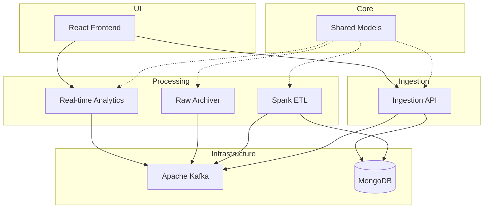

# Service Orchestration Plan

This plan outlines the orchestration and startup sequence for the Clickstream Analytics platform. It ensures that infrastructure, core services, processing pipelines, and the frontend are initialized in the correct order to handle data flow from ingestion to visualization.

## Dependency Graph

## Startup Phases

| Phase | Description | Key Services |
|-------|-------------|--------------|
| [Phase 01](./phase-01-infrastructure.md) | Infrastructure Layer | Kafka, MongoDB, Kafka UI |
| [Phase 02](./phase-02-core-services.md) | Core & Ingestion | Shared Models, Ingestion API |
| [Phase 03](./phase-03-processing-analytics.md) | Data Processing | Spark ETL, Real-time Analytics, Raw Archiver |
| [Phase 04](./phase-04-frontend.md) | User Interface | React Frontend |

## Orchestration Logic

The optimal startup order is:
1. **Infrastructure**: Start Kafka and MongoDB first. Ensure health checks pass.
2. **Initialization**: Build `shared-models` as it is a dependency for all Java services.
3. **Processing Sinks**: Start `spark-etl` so it's ready to process incoming events and populate MongoDB.
4. **Analytics & Archival**: Start `realtime-analytics` and `raw-archiver`.
5. **Ingestion**: Start `ingestion-api` to begin accepting traffic.
6. **UI**: Start the `frontend` once all backend services are healthy.

## Health Verification

A verification script `scripts/verify-setup.sh` should be used to ensure all components are responding correctly.

- **Kafka**: `kafka-broker-api-versions.sh`
- **MongoDB**: `mongosh --eval "db.adminCommand('ping')"`
- **Ingestion API**: `GET /actuator/health`
- **Real-time Analytics**: `GET /api/realtime/health`
- **Raw Archiver**: `GET /actuator/health`
