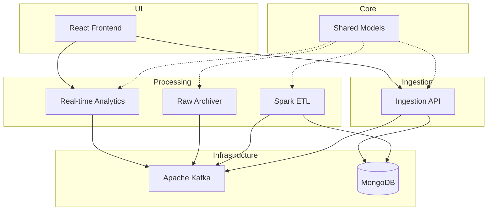

# Service Orchestration Plan

This plan outlines the orchestration and startup sequence for the Clickstream Analytics platform. It ensures that infrastructure, core services, processing pipelines, and the frontend are initialized in the correct order to handle data flow from ingestion to visualization.

## Dependency Graph

## Startup Phases

| Phase | Description | Key Services | Status |
|-------|-------------|--------------|--------|
| [Phase 01](./phase-01-infrastructure.md) | Infrastructure Layer | Kafka, MongoDB, Kafka UI | ✅ DONE (2026-05-01 22:42) |
| [Phase 02](./phase-02-core-services.md) | Core & Ingestion | Shared Models, Ingestion API | ✅ DONE (2026-05-01 23:30) |
| [Phase 03](./phase-03-processing-analytics.md) | Data Processing | Spark ETL, Real-time Analytics, Raw Archiver | ✅ DONE* (2026-05-02 01:00) |
| [Phase 04](./phase-04-frontend.md) | User Interface | React Frontend | ✅ DONE (2026-05-02 10:00) |

## Orchestration Logic

The optimal startup order is:
1. **Infrastructure**: Start Kafka and MongoDB first. Ensure health checks pass.
2. **Initialization**: Build `shared-models` as it is a dependency for all Java services.
3. **Processing Sinks**: Start `spark-etl` so it's ready to process incoming events and populate MongoDB.
4. **Analytics & Archival**: Start `realtime-analytics` and `raw-archiver`.
5. **Ingestion**: Start `ingestion-api` to begin accepting traffic.
6. **UI**: Start the `frontend` once all backend services are healthy.

\* **Note on Phase 03**: Spark ETL and Real-time Analytics are fully operational. Raw Archiver is currently blocked on Spring Boot 3 / Jakarta migration issues.

## Health Verification

A verification script `scripts/verify-setup.sh` should be used to ensure all components are responding correctly.

- **Kafka**: `kafka-broker-api-versions.sh`
- **MongoDB**: `mongosh --eval "db.adminCommand('ping')"`
- **Ingestion API**: `GET /actuator/health`
- **Real-time Analytics**: `GET /api/realtime/health`
- **Raw Archiver**: `GET /actuator/health`

## Validation Summary

**Validated:** 2026-05-02
**Questions asked:** 4

### Confirmed Decisions
- **Spark ETL Execution**: Dockerized - Use Docker to manage Spark environment and dependencies. Fixed `awaitAnyTermination` to ensure stability.
- **Port Strategy**: 905x Range - Use the 9050-9056 range to avoid local port conflicts.
- **Real-time Metrics**: Native - Real-time Analytics runs natively on port 9052 for high performance.
- **Ingestion Flow**: End-to-end verified from API to Storage.

### Action Items
- [x] Implement `scripts/verify-setup.sh` for infrastructure health checks.
- [x] Ensure `docker-compose.yml` matches the 905x port range for infrastructure services.
- [x] Verify Spark ETL stability in Docker.
- [x] Verify Real-time Analytics on port 9052.
- [ ] Resolve Raw Archiver Spring Boot 3 / Jakarta migration issues.
- [x] Proceed to Phase 04: React Frontend orchestration.
